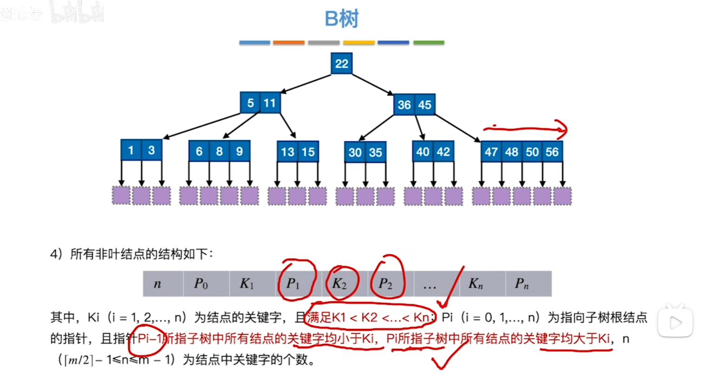

##  B树(多路平衡查找树)

- 树中的每个节点至多有m棵子树，最多有m-1个关键字

- 保证查找效率的规定：除了根结点，任何结点至少有m/2(向上取整)个分叉，至少有m/2-1个关键字

- 保证平衡的规定：每个结点所有子树的高度都相同，即失败结点都在同一层
- 若根结点不是终端节点，则至少有2棵子树
- 关键字的值：

## B树的插入和删除

插入key后，原结点关键字数量超出上限，则从中间位置m/2(向上取整)将结点分为3部分，m/2左边的key组为原结点，右边为新结点，m/2本身提到原节点的根结点中。

新元素的位置确定：一定是插入到最底层终端结点，用查找来确定具体插入位置

## B+树