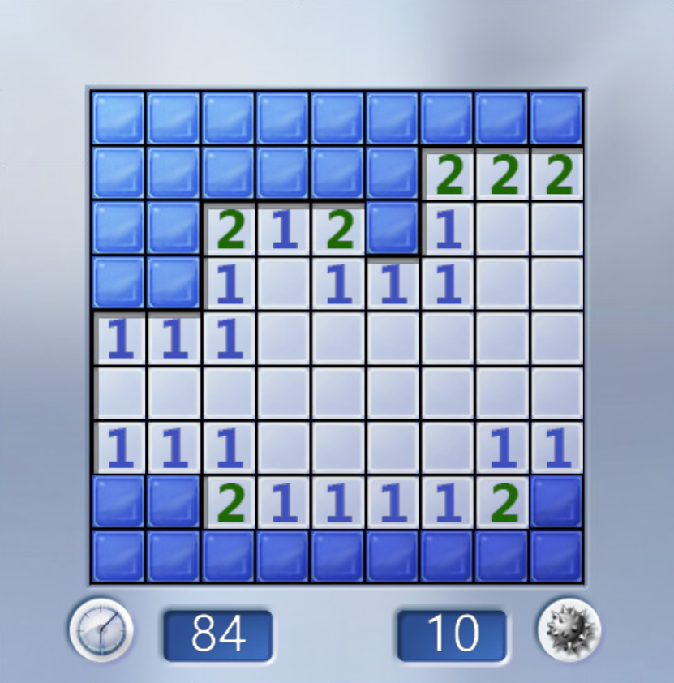

# 初露雏形
```c++
//写的垃圾代码，没有理解原理，代码可读性差，实现效果差
void Expand(int x, int y)
{
	//首先检验坐标是否在地图内
	if (x >= 1 && x <= row && y >= 1 && y <= col)
	{
		//如果为0，要递归
		if (NearBy[x][y] == 0)
		{
			//递归检查周围8个
			for (int i = x - 1; i <= x + 1; i++)
			{
				for (int j = y - 1; j <= y + 1; j++)
				{
					//没有被打开，并且不是自己
					if (Map[i][j] == '*' && (i != x || j != y))
					{
						cnt++;
						Map[i][j] = NearBy[i][j] + 48;//0旁边8个一定会被打开
						Expand(i, j);//递归调用旁边8个，旁边8个如果是0就和刚才一样，不是0,的判断就过不去，不会再递归调用，仅仅打开了自己
					}
				}
			}
		}
	}
}
```

```c++
//改进后的代码，深度优先搜索，保证了每个格子不会被重复遍历
void Expand(int x, int y)
{
	Map[x][y] = NearBy[x][y] + 48;
	if (NearBy[x][y] > 0)return;
	if (!(x >= 1 && x <= row && y >= 1 && y <= col))return;
	for (int i = x - 1; i <= x + 1; i++)
	{
		for (int j = y - 1; j <= y + 1; j++)
		{
			
			if (Map[i][j] == '*')
			{
				cnt++;
				Expand(i, j);
			}
		}
	}
}
```

# DFS.FloodFill
对于扫雷打开一片的操作，它的最外面一圈要么是数字，要么是地图边界，由此我们可以确定递归的终点


1. 递归终点：数字和地图边界外 ，其实也就是判定是否遍历到了叶节点？
2. 本质：图的遍历

选取某一点开始遍历
遍历到的每一点都要打开
遍历到了叶节点回溯，回溯点没有方向可以向下遍历了再回溯


四方向拓展还是八方向拓展: 如果打开了0，根据0的定义和扫雷游戏规则，周围8个都应该自动打开，是8方向拓展


DFS?回溯，若其他方向也无法遍历，再次回溯


```c++
void dfs(int x, int y)
{
	//这行要写上打开的操作 
	//递归终点：数字和地图边界外 ，但是边界的数字同样也要打开，所以我们在上一行要加上打开的操作 
	if()return;
	if()return;
	
	//进入下面的只会是0，所以就要递归了 
	for(int i = x - 1; i <= x+1; i++)
	{
		for(int j = y - 1; j <= y+1; j++)//顺序 
		{
			//不需要判定是否是雷，因为0附近没有雷 
			//要对0周围8个进行if限制，防止死循环 
			//实际上还要考虑边界问题，因为0也会出现在地图边角，遍历他的周围就会造成越界 
                        //递归周围8个，是否要排除掉自己？实际上自己已经被打开了，已经被排除掉了
			if()
			{
				//本来该行要写上打开的操作，但是一开始为了实现写了打开边界数字这里就不用写了 
				
				//实际上是深度搜索？使用递归的方法 
				dfs(i,j);//遍历顺序是深度优先遍历，一直向周围扩展遍历到数字，再回溯，再遍历再回溯。。。	
			}
		}
	}
 } 
```