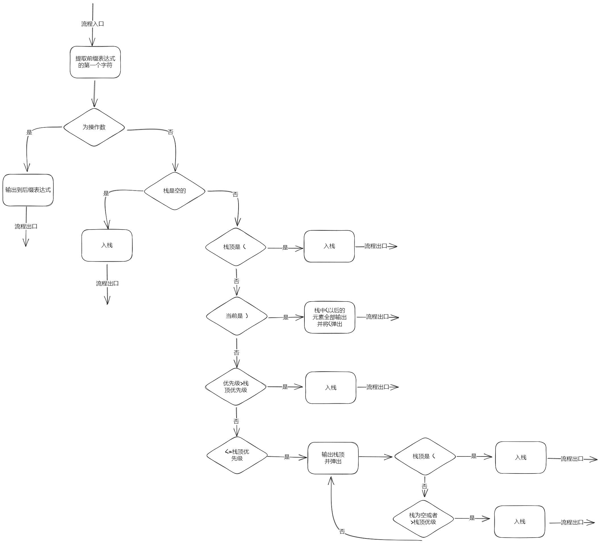

> 实验目的和要求： 
>
> 为了进一步理解利用真值表求主析取范式和主合取范式的理论和方法，具体的实验要求如下： 
>
> 输入：可以是具体的命题公式，也可以是任意的命题公式，如果是给定的具体命题公式，此命题公式中应该包含“否定¬，析取，合取，条件→，双条件↔”这 5 种联接词中的 3种，其中这 3 种联接词中必须包括“条件→” 或“双条件↔”
>
> 命题变元最好不少于 3 个。
>
> 输出：命题公式对应的真值表，及对应的主析取范式和主合取范式。

涉及到的知识：
- c++中map、string、stack的理解和使用,即STL相关
- 后缀表达式


# 写联结词函数

为每个命题联结词写一个函数，每一步计算时，调用对应函数即可得到结果。

具体实现：每次计算，我们用新的特定变量 (res) 将计算结果保存下来

同时，也需要有1个或2个运算数，

！注意，这里埋下了一个伏笔，命题联结词中既有一元也有二元，对应不同的运算数的数量，可能会影响到后续代码的设计。

```C++
int a,b;//a、b保存每次计算时的运算数
int res;//res保存每次计算的结果
//否定
void Not(){
    res=a?0:1;
}
//合取
void And(){
    res=a*b;
}
//析取
void Or(){
    res=(a+b==0)?0:1;
}
//条件
void If(){
    res=(b==1&&a==0)?0:1;
}
//双条件
void Iif(){
    res= a==b?1:0;
}
```

# 化中缀表达式为后缀表达式

前面提到，对于命题联结词，计算机不知道他们的优先级。因此，我们需要将人类熟悉的中缀表达式，转化为计算机方便计算的**后缀表达式**

关于计算机怎么处理后缀表达式之后会讲到，我们先来看什么是后缀表达式

## 后缀表达式

- 顾名思义，中缀表达式是运算符在两个运算数的中间，后缀表达式则是在后面

- 后缀表达式无需知道优先级，只需要从左到右依次计算，因此也不会出现括号

举例说明a+b*c-d
化为后缀表达式abc*+d-

我们处理后缀表达式和计算机大同小异：
从左到右读，遇到第一个运算符，就将运算符前面2个数（数量根据运算符需要几个运算数而定）按这种运算符计算，计算结果放回原来2个运算数的位置，然后一直重复下去。

*补充：人类怎么将一个中缀表达式转为后缀
1. 将表达式中每次计算都用（）框住，有几个运算符就有几对括号
2. （）中的运算符移到自己的）的后面
3. 删去全部的（）

## 用代码中缀转后缀

从左到右开始扫描中缀表达式



上述算法需要用到优先级的比较

可以使用函数，当然用下面的map容器来保存每个运算符的优先级会更好理解

## map特点

- map中的每个元素都是有2个值，即 key-value

- key和value可以是任意你需要的数据类型

- key值起到索引作用，根据key值可以快速找到value值

- 每个元素的顺序根据key值自动排序

- 不允许有重复的key值

## 利用map存储计算符的优先级

  - 定义`map<char,int> mp`
  - 插入元素`mp.insert(make_pair(key值,value值))`
  - 返回key对应的value值`mp[key值]`
  - 返回map中有多少个key值`count(key值)`

## 利用**栈**作为转化表达式的载体

栈的特点：每个数据遵循"先进后出"的原则(如果不知道栈，强烈建议查阅资料或视频)

- 定义`stack<数据类型> s `
- 添加元素(入栈)  `s.push()`
- 移除元素(出栈)  `s.pop()`
- 返回栈顶元素    `s.top()`
- 判断栈是否为空  `s.empty()`
- 返回栈的大小      `s.size()`

## 利用**string类**存储输入的中缀表达式和经过转化后的后缀表达式

- 定义`string str`
- 返回第 i 个字符`str[i]`
- 返回串长`str.length()`

```c++
   //用map容器为每个运算符设定优先级
    mp.insert(make_pair('(',6));
    mp.insert(make_pair('!',5));
    mp.insert(make_pair('&',4));
    mp.insert(make_pair('|',3));
    mp.insert(make_pair('>',2));
    mp.insert(make_pair('~',1));
    mp.insert(make_pair(')',0));//实际上）不用比较优先级，但是也将他存入map以便和运算数区分开来
```

```c++
string emp;//emp存储转化后的后缀表达式
    for(int i=0; i < str.length(); i++) { //注意是小于不是小于等于
        if (!mp.count(str[i])) { emp += str[i]; } //变元直接输出
           
            //是运算符或'('或')'执行下面的else
        else {
            if (s.empty()) { s.push(str[i]); }//栈空，直接进栈，下面的else不会执行
            
            //栈非空，执行下面的else
            else {
                if (s.top() == '(')s.push(str[i]);//栈顶是(，直接进栈

                else if (str[i] == ')') {
                    while (s.top() != '(') {
                        emp += s.top();
                        s.pop();
                    }
                    s.pop();}
                else if (mp[str[i]] > mp[s.top()]) { s.push(str[i]); }
                else//上面三种判断都不满足，也就是优先级小于栈顶的运算符优先级
                    while (true) {
                        if (s.size() && s.top() == '(') {
                            s.push(str[i]);
                            break;
                        }
                        if (s.empty()|| mp[str[i]] > mp[s.top()]) {
                            s.push(str[i]);
                            break;
                        }
                        else {emp += s.top(); s.pop();}
                    }

            }//栈非空符号处理结束
        }//是运算符或'('或')'处理结束
    }//循环结束
    while(!s.empty()) { emp+=s.top();s.pop();}
    //最后处理栈内剩余的运算符，经过上面的代码后，这些运算符以优先级从大到小的顺序排列
```


# 计算后缀表达式

根据后缀表达式，计算机就可以轻松计算出后缀表达式的值了

1. 从左到右扫描每个字符，是运算数就让他入栈
2. 遇到运算符，判断是一元运算符运算符还是二元运算符，对应弹出几个运算数，并调用对应运算符函数计算
3. 将计算后所得结果入栈，作为下一次计算的运算数
4. 直到全部扫描完毕。

这里还有一个问题：后缀表达式中的运算数是字符形式，如何将字符转化为我们需要的实际数字（0和1）呢？对于每个变元额外定义一个代表他的真值的变量即可
比如对于变元P，我们定义一个int类型的p来代表变元P的一种真值，如果扫描到P，将p入栈即可

可以使用if语句来判断是哪个变元，当然使用下面的条件运算符会更方便。

`ChangedFormula[i] == 'P' ? p : ChangedFormula[i] == 'Q' ? q : r`

```c++
string ChangedFormula;//保存了后缀表达式
void Calculate(){
    for(int i=0;i<ChangedFormula.length();i++){
        if(!mp.count(ChangedFormula[i])){
            c.push(ChangedFormula[i] == 'P' ? p : ChangedFormula[i] == 'Q' ? q : r);//这里是重点
            continue;
        }
        else{
            JudgeOperator(ChangedFormula[i]);//判断是一元运算符还是二元运算符
            ChooseOperator(ChangedFormula[i]);//调用运算符对应的函数
            c.push(res);//将计算结果入栈
        }
    }
    c.pop();//将最后的计算结果弹出
}

int a,b;//设置2个int型全局变量a、b保存出栈后要计算的数
stack<int> c;//c是计算时的栈
void JudgeOperator(char ch){
    if(ch!='!'){
        a=c.top();c.pop();
        b=c.top();c.pop();
    }
    else{
        a=c.top();c.pop();
    }
}
void ChooseOperator(char ch){
    switch (ch) {
        case '!':Not();
            break;
        case '&':And();
            break;
        case '|':Or();
            break;
        case '>':If();
            break;
        case '~':Iif();
            break;
    }
}
```

可以用数字0/1表示了，但是p、q、r的取值情况一共有8种情况，如何赋值？下面会讲到

# 输出真值表

计算出每种赋值情况下，命题公式的真值后，就可以输出真值表。

| P    | Q    | R    | 命题公式 |
| ---- | ---- | ---- | -------- |
| 1    | 1    | 1    | 1        |
| 1    | 1    | 0    | 1        |
| 1    | 0    | 1    | 1        |
| 1    | 0    | 0    | 1        |
| 0    | 1    | 1    | 1        |
| 0    | 1    | 0    | 1        |
| 0    | 0    | 1    | 1        |
| 0    | 0    | 0    | 1        |

1.输出命题和命题公式的符号，即真值表的第一行，直接单行cout即可

2.n个变元，有2的n次方种情况，显然使用**循环**遍历p、q、r取值的每种情况 ，每个循环过程中cout p、q、r的真值并调用（计算命题公式的真值）函数来计算对应情况下命题公式的真值再输出

```c++
void Print(){
    //输出首行，因为是表格，所以要用到\t
    cout << "P\t" << "Q\t" << "R\t" << OriginalFormula << endl;
    for (p = 1; p >= 0; p--)
    {
        for (q = 1; q >= 0; q--)
        {
            for (r = 1; r >= 0; r--)
            {
                Calculate();
                cout << p << "\t" << q << "\t" << r << "\t" << res << endl;
            }
        }
    }
}
```

# 求主范式并输出

使用2个字符串类型分别保存主析取范式和主合取范式，离散数学中利用真值表求主范式的方法很容易运用到代码中。

下面是得出命题公式的一个真值后，判断是极大项还是极小项并保存到到对应的主范式中的代码

```c++
                if(res==1){
                    Pdnf = Pdnf + "(" + (p == 1 ? "P" : "┐P") + "∧" + (q == 1 ? "Q" : "┐Q") + "∧" + (r == 1 ? "R" : "┐R") + ")" + "∨";
                }
                else{
                    Pcnf =Pcnf + "(" + (p == 0 ?"P":"┐P") + "∨" + (q==0?"Q":"┐Q")+"∨"+ (r==0?"R":"┐R")+ ")" + "∧";
```

因为求主范式的过程是在求真值过程中进行的，并不知道范式到底有多少个项，所以主范式的末尾会多出来一个析取或合取号，需要在输出时处理一下。

特殊情况：如果一个式子永真，就没有主合取范式，永假，就没有主析取范式，要特别处理
下面是输出主范式的代码

```c++
void Printpnf(){
    if(Pdnf.empty()){
        cout<< "命题公式永假，主析取范式不存在" << endl;
    }
    else {
        Pdnf.erase(Pdnf.length() - 2);
    cout << "主析取范式为：" << Pdnf << endl;
    }
    if(Pcnf.empty()){
        cout<<"命题公式永真，主合取不存在"<<endl;
    }
    else{
        Pcnf.erase(Pcnf.length() - 2);
        cout << "主合取范式为：" << Pcnf << endl;
    }
}
```